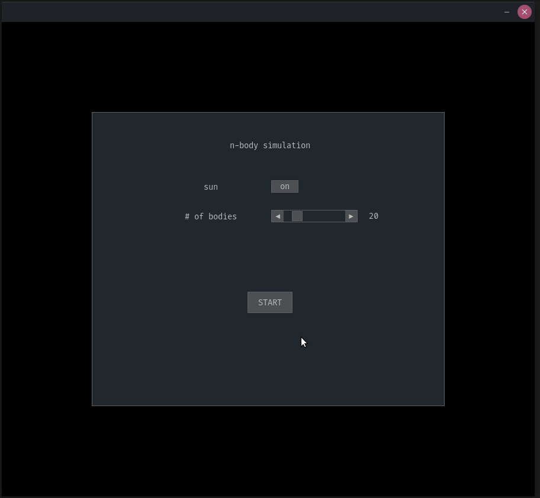

# N-Body Simulation with PyGame

<br>

## Installation

```
$ git clone https://github.com/dbusteed/nbody_pygame
$ cd nbody_pygame
$ pip install pygame pygame_gui numpy
$ python main.py
```

<br>

## Demo

